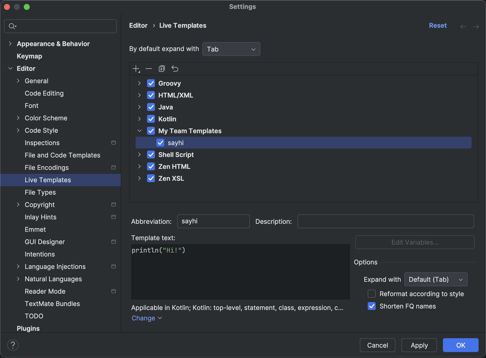
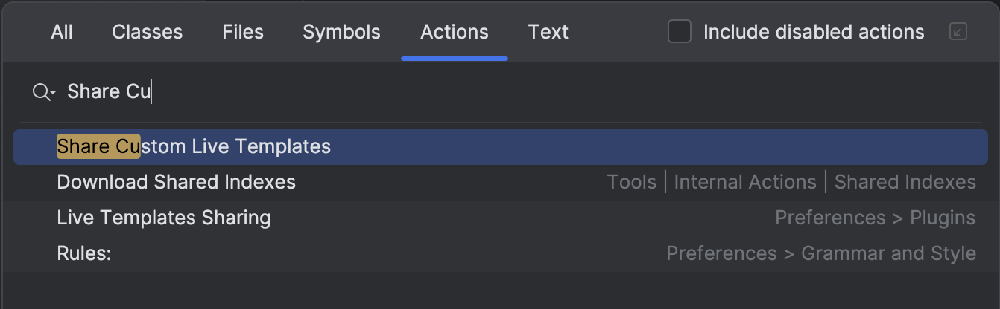

# IntelliJ Live Templates Sharing Plugin
The plugin allows to share custom IntelliJ IDEA live templates with a team by putting them to `.idea/liveTemplates` folder.

## Sharing Live Templates
1. Create custom live template group in Settings and add your live templates there. Press `OK` to save the changes.  

2. Invoke the `Share Custom Live Templates` action from `Go to Action` (`Ctrl/Cmd + Shift + A`)

3. After action successfully executed, you will see your live templates in the `.idea/liveTemplates` folder

4. Commit shared live templates to your repository

## Importing Live Templates
Everybody with plugin installed who open repository will import shared live templates automatically when they open project next time.

### Manual import
There is the action to import live templates manually.
Invoke the `Import Project Live Templates` action from `Go to Action` (`Ctrl/Cmd + Shift + A`)

## Limitations
- If you open multiple projects and some of them contain templates with the same name, only first loaded project's templates with the same name will be synced.
- The plugin works by copying shared live templates groups to the IDE settings, so technically when you open the project with shared live templates the plugin will add shared groups from project to your IDE settings.
- The plugin supports **only custom** live templates group. If you add live templates to predefined groups, they will not be shared.
